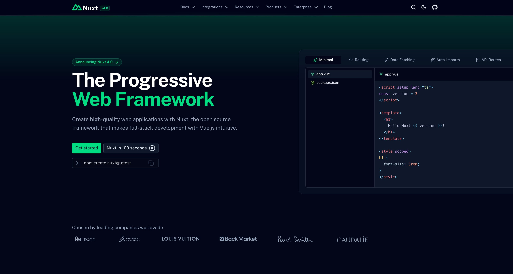

<a href="https://nuxt.com"></a>

# nuxt.com

Welcome to the Nuxt website repository available on [nuxt.com](https://nuxt.com).

[](https://ui.nuxt.com/pro)

## Setup

Make sure to enable corepack and install the dependencies:

```bash
corepack enable
pnpm install
```

Copy the `.env.example` file to `.env`:

```bash
cp .env.example .env
```

Clone/Fork [nuxt/nuxt](https://github.com/nuxt/nuxt) repo where you want (but not in the Nuxt.com project) and inside the root of the repo, run:

```bash
pwd
```

If you are on Windows, you can use the following command instead:

```bash
echo %cd%
```

Copy the output of the command above and paste it in the `NUXT_PATH` and `NUXT_V4_PATH` variables in the `.env` file.

## Development

Start the development server:

```bash
pnpm dev
```

### Add a Nuxt Template

To list a Nuxt template, add a file in the [./content/templates](./content/templates) directory.

Make sure to start the development server in order to generate the screenshot for the template and go to http://localhost:3000/templates to see the result.

If you want to update the url where we take the automated screenshot, use the `screenshotUrl` property.

To regenerate the image, delete the generated one in `public/assets/templates`.

## Production

In order to build the application for production, you need to have a [Nuxt UI Pro](https://ui.nuxt.com/pro) license and set the `NUXT_UI_PRO_LICENSE` variable in the `.env` file.

Note that this is not required to run in development and contribute to the Nuxt website or documentation.

Build the application for production:

```bash
pnpm generate
```

## License

[MIT License](./LICENSE)
