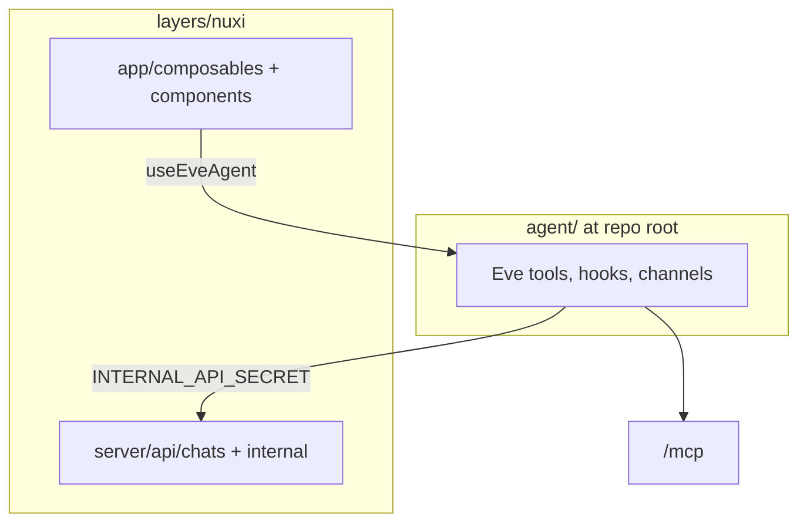

# Nuxi layer (Eve)

Nuxi is the AI assistant embedded in nuxt.com. It runs as a **dual service** on Vercel: the Nuxt web app and an Eve worker that hosts the agent runtime.

## Boundaries



### `agent/` — Eve runtime

- Lives at the repo root in `agent/` (canonical Eve layout).
- Deployed via the `eve` Vercel service entrypoint.
- **Never touches the database directly.** All persistence goes through the internal Nuxt API.

### `server/api/internal/` — Agent → Nuxt bridge

- Protected by bearer token `INTERNAL_API_SECRET`.
- Used by Eve tools (`defineNuxtTool`) for content cards, chat state, rate limits, web search, etc.

### `server/api/chats/` — Public user API

- Session-authenticated routes for chat CRUD, messages, votes, and Eve state sync from the browser.

### `app/composables/` — UI client

- `useAgentChat` — orchestrator (start page vs active chat).
- `eve/` — Eve agent registry, session, thread persistence.
- `useChatVotes`, `usePasteAttachment` — focused helpers.

## Local development

```bash
pnpm dev:full   # Nuxt + Eve worker
pnpm typecheck
```

The `eve/nuxt` module wires the agent routes into the Nuxt app; Vercel deploys it as a dual-service project (`web` + `eve`).
